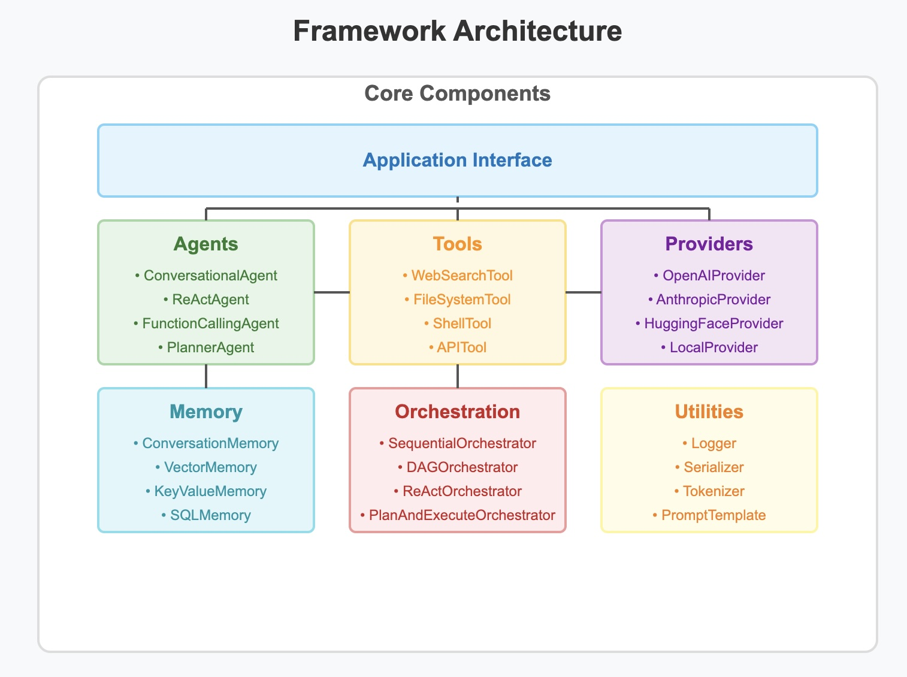

# AgentFlow: Large Language Model Agent Flow Framework

A Flexible framework for building LLM-based agent systems.

## Architecture

The framework provides a modular architecture for building LLM-based agent systems:



## Overview

Agent Framework is designed to standardize the development of LLM-based agent systems. It provides a consistent interface for working with different LLM providers, tools, and orchestration patterns.

## Key Features

- **Provider Agnostic**: Works with multiple LLM providers (OpenAI, Anthropic, etc.)
- **Modular Architecture**: Components are designed to be interchangeable and extensible
- **Standardized Interfaces**: Consistent interfaces across different components
- **Multiple Agent Types**: Support for various agent patterns (Conversational, ReAct, etc.)
- **Flexible Orchestration**: Support for different orchestration strategies
- **Built-in Tools**: Common tools for web search, file system access, etc.
- **Memory Systems**: Various memory implementations for different use cases

## Installation

```bash
git clone https://github.com/mourad-ghafiri/agentflow.git
cd agentflow
pip install -e .
```

## Documentation

For more detailed documentation, see the [docs](./docs) directory.

## Quick Start

### Example 1: Simple Agent

This example demonstrates the most basic usage of the AgentFlow framework with a simple conversational agent.

```python
import os
import asyncio
from dotenv import load_dotenv
from framework.core.app import AgentFlowApp
from framework.core.providers import OpenAIProvider

# Load environment variables
load_dotenv()

async def main():
    # Check for API key
    openai_api_key = os.getenv("OPENAI_API_KEY")
    
    # Create the application
    app = AgentFlowApp(
        name="Simple Agent App", 
        description="A minimal example of using the AgentFlow framework"
    )
    
    # Register OpenAI provider
    app.register_provider("openai", OpenAIProvider(api_key=openai_api_key))
    
    # Create a simple agent
    agent = app.create_agent(
        agent_type="conversational",  # Using the simplest agent type
        name="SimpleAgent",
        description="A simple conversational agent",
        system_prompt="You are a helpful assistant. Keep your responses brief and to the point.",
        model="gpt-3.5-turbo",  # Using a less expensive model for this simple example
        provider="openai"
    )
    
    # Run the agent with a simple query
    user_input = "Hello! Can you tell me what the AgentFlow framework is?"
    print(f"User: {user_input}")
    
    response = await app.run_agent(agent.config.id, user_input)
    print(f"Agent: {response.get('content', 'No response generated')}")

if __name__ == "__main__":
    asyncio.run(main())
```

This example:
1. Creates a minimal AgentFlow application
2. Registers the OpenAI provider
3. Creates a simple conversational agent without any tools
4. Runs the agent with a basic query

### Example 2: Calculator Agent

This example demonstrates how to create a simple calculator agent using the AgentFlow framework.

```python
import os
import asyncio
from dotenv import load_dotenv
from framework.core.app import AgentFlowApp
from framework.core.providers import OpenAIProvider
from framework.tools.base import FunctionTool

# Load environment variables
load_dotenv()

# Create simple calculator tools
def add(a: int, b: int) -> int:
    """Add two numbers together and return the result."""
    return a + b

def subtract(a: int, b: int) -> int:
    """Subtract b from a and return the result."""
    return a - b

def multiply(a: int, b: int) -> int:
    """Multiply two numbers together and return the result."""
    return a * b

def divide(a: float, b: float) -> float:
    """Divide a by b and return the result."""
    if b == 0:
        raise ValueError("Cannot divide by zero")
    return a / b

async def main():
    # Check for API key
    openai_api_key = os.getenv("OPENAI_API_KEY")
    
    # Create the application
    app = AgentFlowApp(name="Calculator Assistant", description="An assistant that can perform calculations")
    
    # Register OpenAI provider
    app.register_provider("openai", OpenAIProvider(api_key=openai_api_key))
    
    # Register tools
    app.register_tool(FunctionTool(add))
    app.register_tool(FunctionTool(subtract))
    app.register_tool(FunctionTool(multiply))
    app.register_tool(FunctionTool(divide))
    
    # Create the math agent
    math_agent = app.create_agent(
        agent_type="react",
        name="MathAgent",
        description="An agent that can perform calculations",
        system_prompt="""You are a helpful calculator assistant. You can perform calculations using the available tools.""",
        model="gpt-4",
        provider="openai",
        tools=["add", "subtract", "multiply", "divide"]
    )
    
    # Run the agent
    user_input = "Can you calculate (15 * 3) - (10 / 2) for me?"
    print(f"User: {user_input}")
    
    response = await app.run_agent(math_agent.config.id, user_input)
    print(f"Agent: {response.get('content')}")

if __name__ == "__main__":
    asyncio.run(main())
```

This example:
1. Creates a simple calculator agent with basic arithmetic functions
2. Registers these functions as tools with the AgentFlow framework
3. Creates a ReAct agent that can use these tools to solve math problems
4. Runs the agent with a sample calculation request

### Example 3: Conversational Agent

This example demonstrates how to create a simple conversational agent without any tools.

```python
import os
import asyncio
from dotenv import load_dotenv
from framework.core.app import AgentFlowApp
from framework.core.providers import OpenAIProvider

# Load environment variables
load_dotenv()

async def main():
    # Check for API key
    openai_api_key = os.getenv("OPENAI_API_KEY")
    
    # Create the application
    app = AgentFlowApp(name="Conversation App", description="A simple conversational agent app")
    
    # Register OpenAI provider
    app.register_provider("openai", OpenAIProvider(api_key=openai_api_key))
    
    # Create a conversational agent
    agent = app.create_agent(
        agent_type="conversational",
        name="Chat Assistant",
        description="A helpful chat assistant",
        system_prompt="You are a friendly and helpful assistant. Respond concisely and accurately.",
        model="gpt-4",
        provider="openai"
    )
    
    # Run the agent
    user_input = "What is machine learning?"
    print(f"User: {user_input}")
    
    response = await app.run_agent(agent.config.id, user_input)
    print(f"Agent: {response.get('content', 'No content in response')}")

if __name__ == "__main__":
    asyncio.run(main())
```

This example:
1. Creates a simple conversational agent without any tools
2. Uses the OpenAI provider with GPT-4
3. Runs the agent with a sample question about machine learning

### Example 4: Function Calling Agent

This example demonstrates how to create an agent that uses function calling to interact with tools.

```python
import os
import asyncio
from dotenv import load_dotenv
from framework.core.app import AgentFlowApp
from framework.core.providers import OpenAIProvider
from framework.tools.base import FunctionTool

# Load environment variables
load_dotenv()

# Create weather and location tools (simplified mocks)
def get_weather(location: str, date: str = "today") -> dict:
    """Get the weather forecast for a location."""
    # This is a mock implementation
    weather_data = {
        "paris": {"today": {"condition": "Sunny", "temperature": 22, "humidity": 60}},
        "london": {"today": {"condition": "Rainy", "temperature": 15, "humidity": 80}},
        "new york": {"today": {"condition": "Cloudy", "temperature": 18, "humidity": 70}},
        "tokyo": {"today": {"condition": "Clear", "temperature": 25, "humidity": 55}}
    }
    
    location = location.lower()
    if location not in weather_data:
        return {"error": f"Weather data not available for {location}"}
    
    if date not in weather_data[location]:
        return {"error": f"Weather data not available for {date} in {location}"}
    
    return weather_data[location][date]

def get_location_info(location: str) -> dict:
    """Get information about a location."""
    # This is a mock implementation
    location_data = {
        "paris": {"country": "France", "timezone": "CET", "season": "Summer"},
        "london": {"country": "United Kingdom", "timezone": "GMT", "season": "Summer"},
        "new york": {"country": "United States", "timezone": "EST", "season": "Summer"},
        "tokyo": {"country": "Japan", "timezone": "JST", "season": "Summer"}
    }
    
    location = location.lower()
    if location not in location_data:
        return {"error": f"Location data not available for {location}"}
    
    return location_data[location]

async def main():
    # Check for API key
    openai_api_key = os.getenv("OPENAI_API_KEY")
    
    # Create the application
    app = AgentFlowApp(name="Function Calling App", description="An app with a function calling agent")
    
    # Register OpenAI provider
    app.register_provider("openai", OpenAIProvider(api_key=openai_api_key))
    
    # Register tools
    app.register_tool(FunctionTool(get_weather))
    app.register_tool(FunctionTool(get_location_info))
    
    # Create a function calling agent
    agent = app.create_agent(
        agent_type="function_calling",
        name="Weather Assistant",
        description="An agent that can check weather and provide recommendations",
        system_prompt="You are a weather assistant. Use the tools available to check weather and provide recommendations for clothing and activities based on the weather.",
        model="gpt-4",
        provider="openai",
        tools=["get_weather", "get_location_info"]
    )
    
    # Run the agent
    user_input = "What's the weather like in Paris today and what should I wear?"
    print(f"User: {user_input}")
    
    response = await app.run_agent(agent.config.id, user_input)
    print(f"Agent: {response.get('content', 'No content in response')}")

if __name__ == "__main__":
    asyncio.run(main())
```

This example:
1. Creates mock tools for getting weather and location information
2. Registers these tools with the AgentFlow framework
3. Creates a function calling agent that can use these tools
4. Runs the agent with a sample question about weather in Paris


### Example 5: Planner Agent

This example demonstrates how to create a planner agent that generates structured plans.

```python
import os
import asyncio
from dotenv import load_dotenv
from framework.core.app import AgentFlowApp
from framework.core.providers import OpenAIProvider

# Load environment variables
load_dotenv()

async def main():
    # Check for API key
    openai_api_key = os.getenv("OPENAI_API_KEY")
    
    # Create the application
    app = AgentFlowApp(name="Planner App", description="An app with a planner agent")
    
    # Register OpenAI provider
    app.register_provider("openai", OpenAIProvider(api_key=openai_api_key))
    
    # Create a planner agent
    agent = app.create_agent(
        agent_type="planner",
        name="Trip Planner",
        description="An agent that creates travel plans",
        system_prompt="""You are a travel planner. Create detailed travel plans with steps, activities, and recommendations.
Format your response as a JSON object with the following structure:
{
  "description": "Brief overview of the trip plan",
  "steps": [
    {
      "description": "Detailed description of each step or day of the trip"
    }
  ]
}""",
        model="gpt-4",
        provider="openai"
    )
    
    # Run the agent
    user_input = "Plan a 3-day trip to Tokyo for a family with two children."
    print(f"User: {user_input}")
    
    plan = await app.run_agent(agent.config.id, user_input)
    
    # Handle the case where the response might not be properly formatted
    if isinstance(plan, dict) and 'description' in plan and 'steps' in plan:
        print(f"Plan description: {plan['description']}")
        print("Steps:")
        for i, step in enumerate(plan['steps'], 1):
            if isinstance(step, dict) and 'description' in step:
                print(f"{i}. {step['description']}")
            else:
                print(f"{i}. {step}")
    else:
        print("Received response was not in the expected format:")
        print(plan)

if __name__ == "__main__":
    asyncio.run(main())
```

This example:
1. Creates a planner agent that generates structured travel plans
2. Configures the agent to return responses in a specific JSON format
3. Processes the structured response to display the plan in a user-friendly format
4. Demonstrates how to handle potentially malformed responses

### Example 7: Multi-Agent Orchestration

This example demonstrates how to create a multi-agent system with sequential orchestration.

```python
import os
import asyncio
from typing import Dict, List, Any
from dotenv import load_dotenv
from pydantic import BaseModel, Field
from framework.core.app import AgentFlowApp
from framework.core.providers import OpenAIProvider, AnthropicProvider
from framework.tools.base import FunctionTool, PydanticTool

# Load environment variables
load_dotenv()

# Define research tools
def search_web(query: str) -> List[Dict[str, str]]:
    """Simulated web search tool."""
    # This is a mock implementation
    return [
        {
            "title": "Example Result 1",
            "snippet": f"This is an example search result for '{query}'. It contains information about the topic."
        },
        {
            "title": "Example Result 2",
            "snippet": f"Another example result for '{query}' with different information and details."
        }
    ]

class ExtractInsightsInput(BaseModel):
    """Input model for extracting insights."""
    text: str = Field(..., description="The text to extract insights from")
    max_insights: int = Field(3, description="Maximum number of insights to extract")

class ExtractInsightsOutput(BaseModel):
    """Output model for extracted insights."""
    insights: List[str] = Field(..., description="The extracted insights")

class InsightExtractionTool(PydanticTool):
    """Tool for extracting insights from text."""
    
    def __init__(self):
        super().__init__(
            name="extract_insights",
            description="Extract key insights from text content",
            input_model=ExtractInsightsInput,
            output_model=ExtractInsightsOutput
        )
    
    async def _execute_with_validated_input(self, validated_input: ExtractInsightsInput) -> ExtractInsightsOutput:
        """Execute insight extraction on the input text."""
        # This is a mock implementation that would normally use an LLM
        insights = [
            f"Insight 1 from the text: {validated_input.text[:20]}...",
            f"Insight 2 from the text: {validated_input.text[20:40]}..."
        ]
        if validated_input.max_insights > 2:
            insights.append(f"Insight 3 from the text: {validated_input.text[40:60]}...")
        
        return ExtractInsightsOutput(insights=insights)

async def main():
    # Check for API key
    openai_api_key = os.getenv("OPENAI_API_KEY")
    
    # Create the application
    app = AgentFlowApp(name="Research Assistant System", description="A multi-agent system for research assistance")
    
    # Register providers
    anthropic_api_key = os.getenv("ANTHROPIC_API_KEY")
    
    app.register_provider("openai", OpenAIProvider(api_key=openai_api_key))
    if anthropic_api_key:
        app.register_provider("anthropic", AnthropicProvider(api_key=anthropic_api_key))
    
    # Register tools
    app.register_tool(FunctionTool(search_web))
    app.register_tool(InsightExtractionTool())
    
    # Create agents
    
    # 1. Research Agent - Searches for information
    research_agent = app.create_agent(
        agent_type="react",
        name="ResearchAgent",
        description="An agent that performs research by searching the web",
        system_prompt="""You are a research assistant specialized in finding information.
When given a research question or topic, use the search_web tool to find relevant information.
Return the search results along with a brief summary of what you found.""",
        model="gpt-4",
        provider="openai",
        tools=["search_web"]
    )
    
    # 2. Analysis Agent - Analyzes the research results
    analysis_agent = app.create_agent(
        agent_type="react",
        name="AnalysisAgent",
        description="An agent that analyzes research results to extract insights",
        system_prompt="""You are an analysis assistant specialized in extracting insights from research information.
When given research results, analyze them carefully and extract the key insights using the extract_insights tool.
Return the extracted insights along with your reasoning.""",
        model="gpt-4",
        provider="openai",
        tools=["extract_insights"]
    )
    
    # 3. Summary Agent - Creates a final summary
    summary_agent = app.create_agent(
        agent_type="react",
        name="SummaryAgent",
        description="An agent that creates clear, concise summaries",
        system_prompt="""You are a summary specialist who excels at creating clear, concise summaries.
When given a set of insights and analysis, create a final comprehensive summary that ties everything together.
Your summary should be well-structured and easy to understand.""",
        model="gpt-4",
        provider="openai",
        tools=[]
    )
    
    # Create a sequential orchestrator
    orchestrator = await app.create_orchestrator(
        orchestrator_type="sequential",
        name="ResearchWorkflow",
        description="A sequential workflow for research, analysis, and summarization",
        agents=[research_agent.config.id, analysis_agent.config.id, summary_agent.config.id],
        workflow={
            "sequence": [
                research_agent.config.id,
                analysis_agent.config.id,
                summary_agent.config.id
            ]
        }
    )
    
    # Run the orchestrator
    user_input = "I'd like to research the impact of artificial intelligence on healthcare"
    print(f"User request: {user_input}")
    
    response = await app.run_orchestrator(orchestrator.config.id, user_input)
    print(f"\nFinal Summary:\n{response.get('content')}")

if __name__ == "__main__":
    asyncio.run(main())
```

This example:
1. Creates a multi-agent system with three specialized agents:
   - A Research Agent that searches for information
   - An Analysis Agent that extracts insights from the research
   - A Summary Agent that creates a final summary
2. Defines custom tools including a web search tool and a Pydantic-based insight extraction tool
3. Creates a sequential orchestrator that chains the agents together in a workflow
4. Demonstrates how to pass information between agents in a multi-step process

### Example 8: DAG Orchestration

This example demonstrates how to create a more complex multi-agent system using a Directed Acyclic Graph (DAG) for orchestration.

```python
import os
import asyncio
from typing import Dict, List, Any
from dotenv import load_dotenv
from pydantic import BaseModel
from framework.core.app import AgentFlowApp
from framework.core.providers import OpenAIProvider
from framework.tools.base import FunctionTool

# Load environment variables
load_dotenv()

# Define some sample tools
def fetch_user_preferences(user_id: str) -> Dict[str, Any]:
    """Fetches user preferences from a simulated database."""
    # This is a mock implementation
    return {
        "interests": ["AI", "machine learning", "data science"],
        "content_type_preference": "article",
        "technical_level": "intermediate"
    }

def fetch_latest_content(category: str, count: int = 3) -> List[Dict[str, str]]:
    """Fetches the latest content in a category."""
    # This is a mock implementation
    return [
        {
            "title": f"{category} News Item 1",
            "summary": f"This is a summary of the latest news in {category}.",
            "technical_level": "beginner"
        },
        {
            "title": f"{category} Tutorial 1",
            "summary": f"A step-by-step tutorial about {category} concepts.",
            "technical_level": "intermediate"
        },
        {
            "title": f"Advanced {category} Concepts",
            "summary": f"Deep dive into advanced {category} topics.",
            "technical_level": "advanced"
        }
    ][:count]

def generate_personalized_summary(content: List[Dict[str, Any]], preferences: Dict[str, Any]) -> str:
    """Generate a personalized summary based on content and user preferences."""
    # This is a mock implementation
    filtered_content = [
        item for item in content 
        if item.get("technical_level") == preferences.get("technical_level", "intermediate")
    ]
    return f"Here's a personalized summary based on your {preferences.get('technical_level', 'intermediate')} level in {', '.join(preferences.get('interests', []))}:\n\n" + "\n".join(
        [f"- {item['title']}: {item['summary']}" for item in filtered_content]
    )

async def main():
    # Check for API key
    openai_api_key = os.getenv("OPENAI_API_KEY")
    
    # Create the application
    app = AgentFlowApp(name="Content Recommendation System", description="A multi-agent system for content recommendations")
    
    # Register providers
    app.register_provider("openai", OpenAIProvider(api_key=openai_api_key))
    
    # Register tools
    app.register_tool(FunctionTool(fetch_user_preferences))
    app.register_tool(FunctionTool(fetch_latest_content))
    app.register_tool(FunctionTool(generate_personalized_summary))
    
    # Create agents
    
    # 1. User Profile Agent - Gets user preferences
    profile_agent = app.create_agent(
        agent_type="react",
        name="ProfileAgent",
        description="An agent that fetches and interprets user profile information",
        system_prompt="""You are a user profile specialist. When you receive a user ID,
use the fetch_user_preferences tool to get the user's preferences.
Return the preferences along with a brief interpretation of what these preferences mean.""",
        model="gpt-3.5-turbo",
        provider="openai",
        tools=["fetch_user_preferences"]
    )
    
    # 2. Content Discovery Agent - Finds content for each interest
    discovery_agent = app.create_agent(
        agent_type="react",
        name="DiscoveryAgent",
        description="An agent that discovers relevant content based on user interests",
        system_prompt="""You are a content discovery specialist. When you receive user interests,
fetch the latest content for each interest using the fetch_latest_content tool.
Combine the results and return them.""",
        model="gpt-3.5-turbo",
        provider="openai",
        tools=["fetch_latest_content"]
    )
    
    # 3. Personalization Agent - Personalizes content based on user preferences
    personalization_agent = app.create_agent(
        agent_type="react",
        name="PersonalizationAgent",
        description="An agent that personalizes content based on user preferences",
        system_prompt="""You are a content personalization specialist. When you receive content and user preferences,
use the generate_personalized_summary tool to create a personalized summary.
Return the personalized summary.""",
        model="gpt-3.5-turbo",
        provider="openai",
        tools=["generate_personalized_summary"]
    )
    
    # 4. Presentation Agent - Creates a final presentation
    presentation_agent = app.create_agent(
        agent_type="react",
        name="PresentationAgent",
        description="An agent that creates a final presentation",
        system_prompt="""You are a presentation specialist. When you receive personalized content,
create a final presentation with a friendly introduction, the content, and a closing statement.
Make it conversational and engaging.""",
        model="gpt-4",
        provider="openai",
        tools=[]
    )
    
    # Create a DAG orchestrator
    orchestrator = await app.create_orchestrator(
        orchestrator_type="dag",
        name="RecommendationWorkflow",
        description="A DAG workflow for personalized content recommendations",
        agents=[
            profile_agent.config.id, 
            discovery_agent.config.id, 
            personalization_agent.config.id,
            presentation_agent.config.id
        ],
        workflow={
            "entry_point": profile_agent.config.id,
            "final_node": presentation_agent.config.id,
            "dag": {
                profile_agent.config.id: {
                    "dependencies": [],
                    "description": "Fetch user profile information"
                },
                discovery_agent.config.id: {
                    "dependencies": [profile_agent.config.id],
                    "description": "Discover content based on user interests",
                    "input_mapping": {
                        "interests": f"{profile_agent.config.id}"
                    }
                },
                personalization_agent.config.id: {
                    "dependencies": [profile_agent.config.id, discovery_agent.config.id],
                    "description": "Personalize content based on user preferences and discovered content",
                    "input_mapping": {
                        "content": f"{discovery_agent.config.id}",
                        "preferences": f"{profile_agent.config.id}"
                    }
                },
                presentation_agent.config.id: {
                    "dependencies": [personalization_agent.config.id],
                    "description": "Create final presentation"
                }
            }
        }
    )
    
    # Run the orchestrator
    user_input = "user_12345"  # This would normally be a user ID
    print(f"Processing recommendations for user: {user_input}")
    
    response = await app.run_orchestrator(orchestrator.config.id, user_input)
    print(f"\nFinal Recommendation:\n{response.get('content')}")

if __name__ == "__main__":
    asyncio.run(main())
```

This example:
1. Creates a content recommendation system with four specialized agents:
   - A Profile Agent that fetches user preferences
   - A Discovery Agent that finds content based on user interests
   - A Personalization Agent that personalizes content based on preferences
   - A Presentation Agent that creates the final recommendation
2. Defines mock tools for fetching user data and content
3. Creates a DAG orchestrator that defines complex dependencies between agents
4. Demonstrates how to map outputs from one agent as inputs to another agent

## License

MIT 